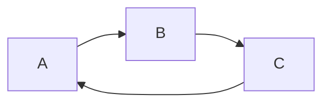
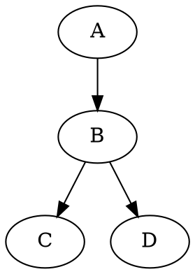

# Diagrams
https://shd101wyy.github.io/markdown-preview-enhanced/#/diagrams?id=diagrams

- Hide code block: set `{hide=true}`
- Only display code block: set `{code_block=true}`
- Put diagram at the center: set `{align="center"}`
- Save as image when export markdown: package setting `imageFolderPath`
- Use customized filename: set `{filename="image.png"}` 

## Flow Charts

notation: `flow` 

```flow
st=>start: Start:>http://www.google.com[blank]
e=>end:>http://www.google.com
op1=>operation: My Operation
sub1=>subroutine: My Subroutine
cond=>condition: Yes or No?:>http://www.google.com
io=>inputoutput: catch sth...

st->op1->cond
cond(yes)->io->e
cond(no)->sub1(right)->op1
```


## Sequence Diagrams

notation: `sequence` 

theme: 
- simple (default)
- hand

```sequence {theme="simple"}
Andrew->China: Says Hello
Note right of China: China thinks\nabout it
China->Andrew: How are you?
Andrew->China: I am good thanks!
```

```sequence {theme="hand"}
Andrew->China: Says Hello
Note right of China: China thinks\nabout it
China->Andrew: How are you?
Andrew->China: I am good thanks!
```


## Mermaid

notation: `mermaid` 

change color theme: package setting `Mermaid Theme`
- default
- dark
- forest




## PlantUML

notation: `puml` or `plantuml`

```puml {align="center"}
A -> B
B -> C
```


## WaveDrom

notation: `wavedrom` 

```wavedrom
{signal: [
    {name: 'clk', wave: 'p..Pp..P'},
    ['Master',
        ['ctrl',
            {name: 'write', wave: '01.0....'},
            {name: 'read', wave: '0...1..0'},
        ],
        {name: 'addr', wave: 'x3.x4..x', data: 'A1 A2'},
        {name: 'wdata', wave: 'x3.x....', data: 'D1'},
    ],
    {},
    ['Slave',
        ['ctrl',
            {name: 'ack', wave: 'x01x0.1x'},
        ],
        {name: 'rdata', wave: 'x.....4x', data: 'Q2'}, 
    ]
]}
```


## GraphViz

notation: `viz` or `dot` 



supported engines: 
- `dot`(default)
- `circo`
- `neato`
- `osage`
- `twopi`


```viz {engine="neato"}
digraph G {
    A -> B
    B -> C
    B -> D
}
```

## Vega and Vega-lite

notation: `vega`, `vega-lite` 

supported input: `JSON`, `YAML`
use `@import` to import a `JSON` or `YAML` file
```
@import "your_vega_source.json" {as="vega"}
@import "your_vega_lite_source.json" {as="vega-lite"}
```


```vega-lite
{
  "data": {
    "values": [
      {"a": "C", "b": 2}, {"a": "C", "b": 7}, {"a": "C", "b": 4},
      {"a": "D", "b": 1}, {"a": "D", "b": 2}, {"a": "D", "b": 6},
      {"a": "E", "b": 8}, {"a": "E", "b": 4}, {"a": "E", "b": 7}
    ]
  },
  "mark": "point",
  "encoding": {
    "x": {"field": "a", "type": "nominal"},
    "y": {"aggregate": "average", "field": "b", "type": "quantitative"},
    "color": {"field": "symbol", "type": "nominal"}
  }
}
```

```vega
{
  "$schema": "https://vega.github.io/schema/vega/v5.json",
  "width": 500,
  "height": 200,
  "padding": 5,

  "signals": [
    {
      "name": "interpolate",
      "value": "linear",
      "bind": {
        "input": "select",
        "options": [
          "basis",
          "cardinal",
          "catmull-rom",
          "linear",
          "monotone",
          "natural",
          "step",
          "step-after",
          "step-before"
        ]
      }
    }
  ],

  "data": [
    {
      "name": "table",
      "values": [
        {"x": 0, "y": 28, "c":0}, {"x": 0, "y": 20, "c":1},
        {"x": 1, "y": 43, "c":0}, {"x": 1, "y": 35, "c":1},
        {"x": 2, "y": 81, "c":0}, {"x": 2, "y": 10, "c":1},
        {"x": 3, "y": 19, "c":0}, {"x": 3, "y": 15, "c":1},
        {"x": 4, "y": 52, "c":0}, {"x": 4, "y": 48, "c":1},
        {"x": 5, "y": 24, "c":0}, {"x": 5, "y": 28, "c":1},
        {"x": 6, "y": 87, "c":0}, {"x": 6, "y": 66, "c":1},
        {"x": 7, "y": 17, "c":0}, {"x": 7, "y": 27, "c":1},
        {"x": 8, "y": 68, "c":0}, {"x": 8, "y": 16, "c":1},
        {"x": 9, "y": 49, "c":0}, {"x": 9, "y": 25, "c":1}
      ]
    }
  ],

  "scales": [
    {
      "name": "x",
      "type": "point",
      "range": "width",
      "domain": {"data": "table", "field": "x"}
    },
    {
      "name": "y",
      "type": "linear",
      "range": "height",
      "nice": true,
      "zero": true,
      "domain": {"data": "table", "field": "y"}
    },
    {
      "name": "color",
      "type": "ordinal",
      "range": "category",
      "domain": {"data": "table", "field": "c"}
    }
  ],

  "axes": [
    {"orient": "bottom", "scale": "x"},
    {"orient": "left", "scale": "y"}
  ],

  "marks": [
    {
      "type": "group",
      "from": {
        "facet": {
          "name": "series",
          "data": "table",
          "groupby": "c"
        }
      },
      "marks": [
        {
          "type": "line",
          "from": {"data": "series"},
          "encode": {
            "enter": {
              "x": {"scale": "x", "field": "x"},
              "y": {"scale": "y", "field": "y"},
              "stroke": {"scale": "color", "field": "c"},
              "strokeWidth": {"value": 2}
            },
            "update": {
              "interpolate": {"signal": "interpolate"},
              "fillOpacity": {"value": 1}
            },
            "hover": {
              "fillOpacity": {"value": 0.5}
            }
          }
        }
      ]
    }
  ]
}
```


## Ditaa

notation: `ditaa`

```ditaa {cmd=true args=["-E"] run_on_save=true}
+--------+   +-------+    +-------+
|        | --+ ditaa +--> |       |
|  Text  |   +-------+    |diagram|
|Document|   |!magic!|    |       |
|     {d}|   |       |    |       |
+---+----+   +-------+    +-------+
    :                         ^
    |       Lots of work      |
    +-------------------------+
```

